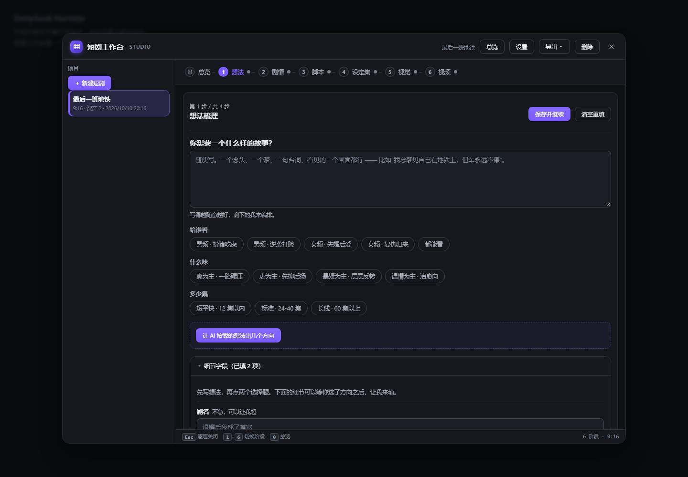
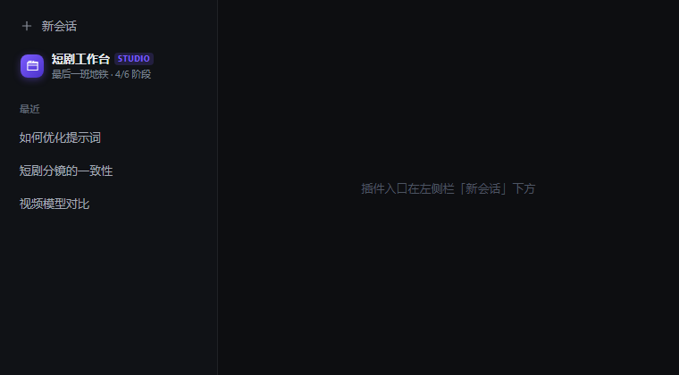

# dsh-aidrama — AI 短剧工作台

给 DeepSeek Harness（DSH）用的 AI 短剧制作插件。把「一个模糊的念头」推进成「可以拍的分镜 + 参考图 + 视频」，
六个阶段依次落地，每一步都可以在侧边栏工作台里看见、修改、重跑。



侧边栏入口会显示当前项目与进度：



```
想法梳理 → 剧情设计 → 分场脚本 → 设定集 → 视觉资产 → 视频成片
  idea       story      script     bible     visual      video
```

## 安装

```bash
# 1. 放进 DSH 插件目录（或任意位置后建 junction/软链）
git clone https://github.com/<you>/dsh-aidrama.git ~/.dsh/plugins/aidrama

# 2. 让 profile 能看到这个包
cd ~/.dsh/profiles/desktop
#    package.json 的 dsh.profile.bundles 里加上 "dsh-aidrama"
#    并把包链接进 node_modules

# 3. 重启 DSH（或在设置里重载），左侧栏会出现「短剧工作台」
```

**零依赖、无构建步骤。** 宿主平面唯一的依赖 `@deepseek-ai/schemastery` 由 DSH 自己提供；
要在本仓库里跑测试的话执行一次 `node docs/link-host-deps.mjs` 把它链进来即可。

### 配置 API Key

图像/视频渠道在 **设置 → 短剧工作台** 里配置。密钥只存在本机 profile 的 `cordis.patch.yml`，
**不会写进本仓库，也不会出现在任何接口返回值里**（`/config` 走白名单投影，只暴露
`apiUrl / hasKey / id / models / name / protocol`）。

## 它解决什么问题

做 AI 短剧的难点从来不是「让模型写个故事」，而是三件事：

1. **一致性**——同一个人物在第 3 集和第 11 集不能长得不一样。
2. **可执行**——剧情要能拆成「哪个场景、哪几个人、几秒、什么景别」的分镜。
3. **素材到片子的链路**——人物三视图、场景主图、分镜参考图、视频提示词之间要能自动传递。

这个插件把这三件事做成一条流水线，并用**结构化契约**把它们锁在一起：每个阶段产出的 JSON 形状是固定的，
下一阶段直接消费上一阶段的产物，不需要人肉复制粘贴。

## 分工：谁写、谁画、谁拍

| 阶段 | 由谁完成 | 说明 |
|---|---|---|
| 1-4 想法 / 剧情 / 脚本 / 设定 | **你正在用的对话模型** | 插件不调用任何外部 LLM。它把「这一阶段该写什么、要返回什么 JSON」交给模型，模型写完提交回来 |
| 5 视觉资产 | **图像模型** | 人物三视图、场景主图、逐镜分镜参考图 |
| 6 视频 | **视频模型**（可配置渠道） | 未配置渠道时导出「提示词包」，流程照样走完 |

这样设计的原因：你已经在 DSH 里有一个能聊的模型了，没必要再让你填一遍 API Key。
文本创作交给对话，插件专注做它擅长的事——**状态管理、提示词工程、图像与视频调度**。

## 六个阶段各自产出什么

### 1. 想法梳理（idea）
把一个念头问清楚：题材、调性、主角、核心冲突、钩子、结局走向。
产出 `{ title, logline, genre, tone, protagonist, conflict, hook, ending, questions[] }`。
`questions` 是模型反过来问你的问题——**最多 3 个**，不搞问卷轰炸。

### 2. 剧情设计（story）
三幕结构、人物欲望与障碍、分集切分与每集钩子。
产出 `acts[]`、`characters[{name,role,want,obstacle}]`、`episodes[{no,title,hook,summary}]`。

### 3. 分场脚本（script）
真正可拍的东西：集 → 场 → 镜。每场有地点、时间、人物、动作、对白、时长；每镜有景别、运镜、画面描述、运动。
产出 `episodes[].scenes[].shots[]`。

### 4. 设定集（bible）
人物卡（外观/发型/脸型/体型/服装/配饰/性格/成长弧）与场景卡（环境/光线/构图）。
每张卡都自带一句**可直接生成的英文/中文提示词**（`sheetPrompt` / `masterPrompt`）。

### 5. 视觉资产（visual）
读设定集和脚本，自动拼提示词并调用图像渠道：

- **人物三视图**——左区正面脸部特写，右区侧/正/背全身立绘，带**三重一致性锁**（面部、身体比例、服装）和可度量的身高锚点。
- **场景主图**——环境气质，明确禁止人物入镜。
- **分镜参考图**——逐镜画面，自动把该镜的人物与场景缝进提示词，保证不出戏。

### 6. 视频成片（video）
逐镜提示词是**运动优先**的（主体动作、运镜、节奏），不是把静帧描述再抄一遍。
配置了视频渠道就直接提交；没有渠道就一键导出提示词包，拿去任何平台都能用。

## 安装

插件目录通过 junction/symlink 挂到 profile 的 `node_modules`，并在 profile 的 `dsh.profile.bundles` 里登记：

```jsonc
// ~/.dsh/profiles/<profile>/package.json
{
  "dsh": {
    "profile": {
      "bundles": [ /* ... , */ "dsh-aidrama" ]
    }
  }
}
```

`cordis.patch.yml` 负责把插件行插进 profile 的层栈：

```yaml
- insert:
    - id: aidrama
      name: dsh-aidrama
```

## 配置

设置里有两个渠道列表：

**图像渠道**（第 5 阶段用）
- `apiUrl` + 密钥 + 模型目录（alias 列表）
- 如果本机装了 `@dickpy/dsh-imagegen`，插件会**直接借用它的生成服务**，于是你已经配好的渠道自动可用，不用再填一遍。
- 否则回退到自己的 OpenAI 兼容 `/images/generations` 调用。

**视频渠道**（第 6 阶段用）
- 协议：`minimax` / `seedance` / `openai-compat` / `prompt-pack`
- `prompt-pack` **不需要密钥、不联网**，永远可用——这是「没有视频 API 也能把流程走完」的兜底。

密钥存在 DSH 的设置文档里（`channelSecrets` / `videoChannelSecrets` 两个字典），
**只留在宿主进程**：所有路由响应、错误信息、资源 URL 都不含密钥明文。

## 给模型用的工具

对话模型通过四个工具驱动项目：

| 工具 | 作用 |
|---|---|
| `aidrama_projects` | 列出 / 创建 / 查看 / 删除项目 |
| `aidrama_brief` | 读取某阶段的**任务说明与目标 JSON 结构**——写之前必须先调 |
| `aidrama_commit_stage` | 提交某阶段的成果，校验结构并推进 |
| `aidrama_generate` | 生成视觉资产（三视图/场景/分镜）或提交视频任务 |

工作方式是「**先读 brief，再写，再提交**」，而不是让模型自由发挥——这是结构能对上的前提。

## 架构

```
lib/
  index.js            宿主入口：设置节、路由挂载、Agent 工具、系统提示词
  client.js           浏览器半：侧边栏入口 + 六阶段工作台
  host/
    protocol.js       冻结契约（阶段、状态、路径、枚举）——两边共享，唯一事实来源
    store.js          项目与素材持久化（原子写、路径防穿越、容量上限）
    stages.js         阶段状态机 + 内容归一化（把模型的自由输出收敛成固定形状）
    prompts.js        提示词工程：三视图/场景/分镜/视频模板 + 各阶段 JSON schema
    routes.js         六个 HTTP 路由族（仅回环，密钥不出宿主）
    video.js          四协议视频适配器（minimax/seedance/openai-compat/prompt-pack）
docs/
  verify-*.mjs         各模块的自检套件（无需测试框架，直接 node 跑）
  run-all-checks.mjs   一次跑完所有套件与闸门（npm test）
  scan-bare-globals.mjs  静态闸门：裸标识符 / 关窗调用
  audit-secrets.mjs    静态闸门：凭据形态扫描
  link-host-deps.mjs   把宿主提供的 schemastery 链进 node_modules
  realtest/
    make-live-preview.mjs  用真实 bundle 渲染工作台并截图
    ui/                    上面那个脚本产出的截图（README 引用）
```

**本仓库只包含插件本身。** 开发过程中的调研记录、第三方资料摘录、
一次性调试脚本都没有随仓库发布。

**关键设计**：Agent 工具和浏览器工作台走**同一套 HTTP 路由**。
只有一份实现，所以「模型提交的东西」和「你在界面上提交的东西」不可能出现行为差异。

## 六阶段的设计依据

### 剧情阶段：麦基《故事》的骨架

一个模糊的念头要变成「让人想看下去的故事」，靠的不是让模型自由发挥，而是**强行套结构**。
`story.js` 把麦基的核心概念做成**可校验的规则**，而不是一句「写得更戏剧化」：

| 概念 | 在插件里的落地 |
|---|---|
| 激励事件 | 必须落在总时长的前 ~12%，且**校验器会检查** |
| 幕与转折点 | 三幕，每幕必须有一个转折点收束 |
| 价值转折 | 每个场景的**价值负荷必须翻转**（希望→绝望），不翻转就被标记 |
| 控制性理念 | 结尾必须**回答**控制性理念，否则报错 |
| 故事鸿沟 | 期望与结果的落差——驱动来源 |

### 爆点：短剧特有的前三秒

检索到的行业口径（**厂商/自媒体数据，非独立研究**）：

> 2026 年短剧平台数据显示，**超 85% 的用户划走行为发生在视频前三秒**，
> 钩子到位的悬疑短剧**留存率提升 68%**、**完播率高出 2.3 倍**。

> 爆火短剧一般 **30 秒内有冲突，2 分钟内出现反转**。

所以 `auditHook` 会把**「开场是环境描写」直接判为错误**——这是留存第一杀手；
`auditPacing` 按默认 **30 秒一个反转**检查节奏，且这个间隔是**可调参数**（`reversalEverySec`），
因为它只是行业经验值，不是定律。

### 一致性：模型是无状态的，所以状态必须外部注入

这是整个做图环节的**根因**：

> AI 短剧角色「变脸」的本质是模型**无状态架构**：每次生成都独立运行，不保留角色记忆。

所以一致性是**工程问题**，不是提示词技巧。`consistency.js` 的做法：

1. **角色锁**：从设定集算出一次 canonical 外观串 + fingerprint，此后**逐字复用**，绝不改写。
   改写的描述就是另一个角色——这是全文件最重要的一条规则。
2. **参考图条件**：分镜图引用已完成的三视图作为条件输入。检索数据显示，这一步能把
   跨镜一致性从 **65% 提升到 92%**（厂商口径），是收益最大的一档。
3. **诚实降级**：三视图还没生成时，退回提示词锁，并在 `rationale` 里**明说**，
   而不是假装用了参考图。
4. **同框人数上限**：约 5 个（超了会互相污染），`auditCrowd` 会预警并给替代方案。

### 运镜：可解析指令，不是形容词

本次调研**最有价值的一条**：

> 要让模型生成电影级镜头语言，**须用可解析运镜指令替代主观词**，
> 如 `[推镜头]` 而非「很有冲击力」。

> **主体场景写最前面，运镜指令放在提示词最后。**

`CAMERA_MOVES` 提供 8 个基础（推/拉/摇/俯仰/移/跟/升降/变焦）+ 进阶
（环绕/希区柯克变焦/复合升降/一镜到底），每个都带方括号 token、速度区间和
**它对观众做了什么**（推 = 压缩空间、聚集注意、增强紧张）——这才是一个运镜选择能被论证的原因。

`auditCamera` 会**主动抓出形容词**并给出应替换的 token，同时检查：
同一运镜连用过多（单调）、固定机位贯穿全场（检索原文：「视频就是像 PPT 一样死板」）、
景别缺乏变化。**有人物特写时用环绕会被标为风险**——检索原文：「人物出镜视频，少用环绕」。

---

## 自检

```bash
node docs/link-host-deps.mjs        # 一次性：把 profile 里的 schemastery 链接进 node_modules
node docs/verify-store.mjs          # 持久化与状态机            120/120
node docs/verify-prompts.mjs        # 提示词与 schema            47/47
node docs/verify-video.mjs          # 视频协议适配器（真实本地 HTTP 服务）  71/71
node docs/verify-routes.mjs         # 路由、回环守卫、密钥卫生      82/82
node docs/verify-client.mjs         # 浏览器半加载契约            66/66
node docs/verify-client-contract.mjs # 独立对抗性探针（宿主缺失/降级 React） 17/17
node docs/verify-host.mjs           # 宿主入口契约（路由/工具/提示词真的注册了）25/25
node docs/verify-story.mjs          # 麦基结构引擎 + 爆点/节奏审计   136/136
node docs/verify-consistency.mjs    # 一致性锁 + 运镜语言引擎       33/33
node docs/verify-craft.mjs          # 两个新引擎是否真的接进流水线    45/45
node docs/verify-e2e.mjs            # 六阶段端到端流水线          75/75
```

**11 个套件、约 720 条断言，连续 3 轮全绿，无抖动。** 全部零依赖、逐条打印 PASS/FAIL、失败退出码非零。

`verify-craft.mjs` 是专门为了防「模块写了但没接线」而存在的：它验证模型真的收到的 brief
里含麦基节拍、生成的分镜提示词真的带锁定 canon 与运镜 token、新增字段真的能穿过
`normalizeStageContent` 不丢，以及两个新引擎是**复用** prompts.js 的负面清单而不是抄一份。

> `lib/host/story.js` 与 `lib/host/consistency.js` 的注释里引用了调研记录的章节号
> （如「§四 钩子」「§五 麦基节拍」）。调研原文属于开发过程材料，**未随本仓库发布**；
> 这些章节号保留下来是为了标明**每条创作规则各自的出处**，方便你判断可信度。
> 请注意：其中的数字（如「85% 的用户在前三秒划走」）来自厂商口径与二手摘要，
> **不是我们实测的**，请按参考而非事实对待。

## 已知边界（诚实说明）

**已验证的**
- 六阶段流水线端到端跑通（真实 store + 真实路由处理器，含素材字节落盘与按 URL 取回）。
- 宿主入口真的注册了 6 个路由族、4 个 Agent 工具和一个系统提示词段落，且可重复 apply、干净销毁。
- 浏览器半在**缺服务、缺选择器、React 降级**的敌对环境下 `apply` 不抛异常（抛异常会让整个 GUI 白屏）。
- 整轮运行中 API 密钥从不出现在任何响应体、错误信息或素材 URL 里。

**未验证的（请当作待办，不是已完成）**

- **视频协议未经真实上游验证。** MiniMax / Seedance 的端点与字段来自公开协议常识，
  不是刚读过的文档线（本机无法访问那些文档站）。源码里每个字段都标了 CONFIDENCE 等级，
  可通过 `uncertainties()` 机器读取。
- **界面未在真实 DSH 窗口里人工点过。** 结构、点击、React 重建后重挂、卸载清理
  都是对着按真实选择器建模的 DOM 桩 + 无头 Chrome 验证的；真实宿主的字体回退与滚动行为未验证。
- **一致性/运镜的效果未经上游逐项验证。** 代码层面证明了「锁定串逐字复用」
  「运镜 token 是机器可读的」「提示词末尾挂运镜指令」，
  但**没有任何证据表明某个渠道真的遵守参考图或识别方括号 token**。
- **首尾帧条件**置信度低，不要在没有实测前承诺首尾帧锁定。
- **Seed 继承**（调研 §九提到的另一种一致性手段）**本插件未实现**——渠道是否接受 seed 参数未知，
  写入一个上游会静默忽略的字段会让用户误以为一致性已被继承。
- 三视图的「三重一致性锁」是提示词层面的约束，**不等于**像素级一致。
- 每项目的画幅会转成 `1080x1920`（9:16）这类**精确尺寸**下发；若某个渠道只认关键字，需手动覆盖。
- 工作台里的**设置面板是只读的**（故意如此），指引你到「设置 → 短剧工作台」。
- **同一批生成的耗时波动很大**（实测 28–54 秒，也遇到过上游 524 超时）。重试通常成功，
  这是上游侧的行为。

## 测试

```bash
node docs/link-host-deps.mjs   # 首次：链入宿主提供的 schemastery
npm test                       # 13 套结构验证 + 2 道静态闸门
```

覆盖范围：状态存储的原子写入、提示词构造、视频适配器、路由契约、浏览器半在缺服务/缺选择器
/React 降级下不抛异常、密钥不泄漏、静态扫描（裸标识符与关窗调用）。

```
ALL GREEN — 15 checks passed
```

两道静态闸门值得一提：

- `docs/scan-bare-globals.mjs` —— 收集「被调用但未声明」的标识符。
  它抓出过两个会抛 `ReferenceError` 的真 bug，也守着一个曾经真实发生过的事故：
  一个模块作用域的 `close()` 解析成了浏览器全局 `window.close()`，**点✕会关掉整个 DSH**。
- `docs/audit-secrets.mjs` —— 按**形态**扫描凭据（各家前缀 + 高熵赋值）。
  测试用的 canary 走显式白名单，而不是放松正则；因此把一个真实密钥塞进 `verify-*.mjs`
  仍然会被抓出来（已做变异测试确认）。

## 许可

MIT
